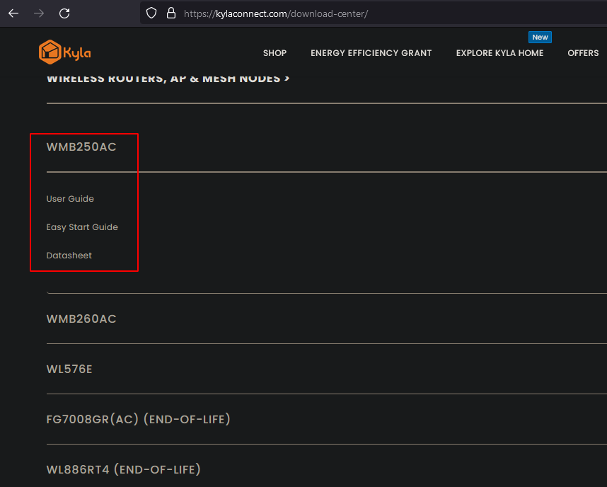
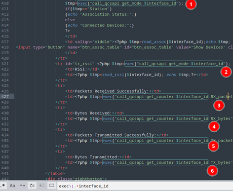

# CVE-2022-45600

| CVE URL:           | https://cve.mitre.org/cgi-bin/cvename.cgi?name=CVE-2022-45600 |
|--------------------|---------------------------------------------------------------|
| Reported by:       | TanYeeTat                                                     |
| Product:           | Aztech WMB250AC Wireless Mesh Routers                         |
| Affected Firmware: | 2020 Release (``topaz-linux.lzma.img``)              |
| Firmware download: | closed source                                                 |

> Product Manual: https://kylaconnect.com/download-center/

> Vulnerability was reported to Aztech's security team via security@aztech.com on **7th June 2022**, with no response as of 21st February 2023
> - [Kylaconnect Vulnerability Disclosure](https://kylaconnect.com/vulnerability-disclosure-policy/)

## Vulnerability Details

A Command Injection vulnerability (that leads to Privilege Escalation) exists in multiple webpages (list below), that allows a web-authenticated user to execute arbitrary shell commands on the device as the ``root`` user. The ``root`` user account could not be accessed in any other conventional methods (e.g., Telnet), and has been locked down by the firmware's configuration. This vulnerability bypasses that configuration and escalates an attacker's privileges to ``root``.

List of affected webpages
- Line ``283`` in ``status_wireless.php``
- Line ``54`` in ``config_wps.php``
- Line ``81`` in ``assoc_table.php``
- Line ``55`` in ``config_macfilter.php``
- Line ``54`` in ``config_wps.php``

There is a lack of input validation and sanitization in the above list of web pages affecting the processing of a ``GET`` parameter,``id``, which is fed into a shell command that is executed as the ``root`` user. Command injection is performed by terminating the preceeding legitimate shell command with a semicolon ``;``, followed by an arbitrary shell command to inject.

> Snippet of retrieving the ``GET`` parameter ``id``
> - the value of ``id`` is stored into ``interface_id`` variable

> Further down the PHP codes, the ``interface_id`` is fed into multiple ``exec()`` calls without validation or sanitization

## Proof of Concept

The following steps will list how to reproduce this vulnerability
1. Start the product physically or emulated
2. Modify the PoC bash script's credentials to authenticate to the web service
3. Execute the PoC bash script to obtain a ``root`` shell on the device

